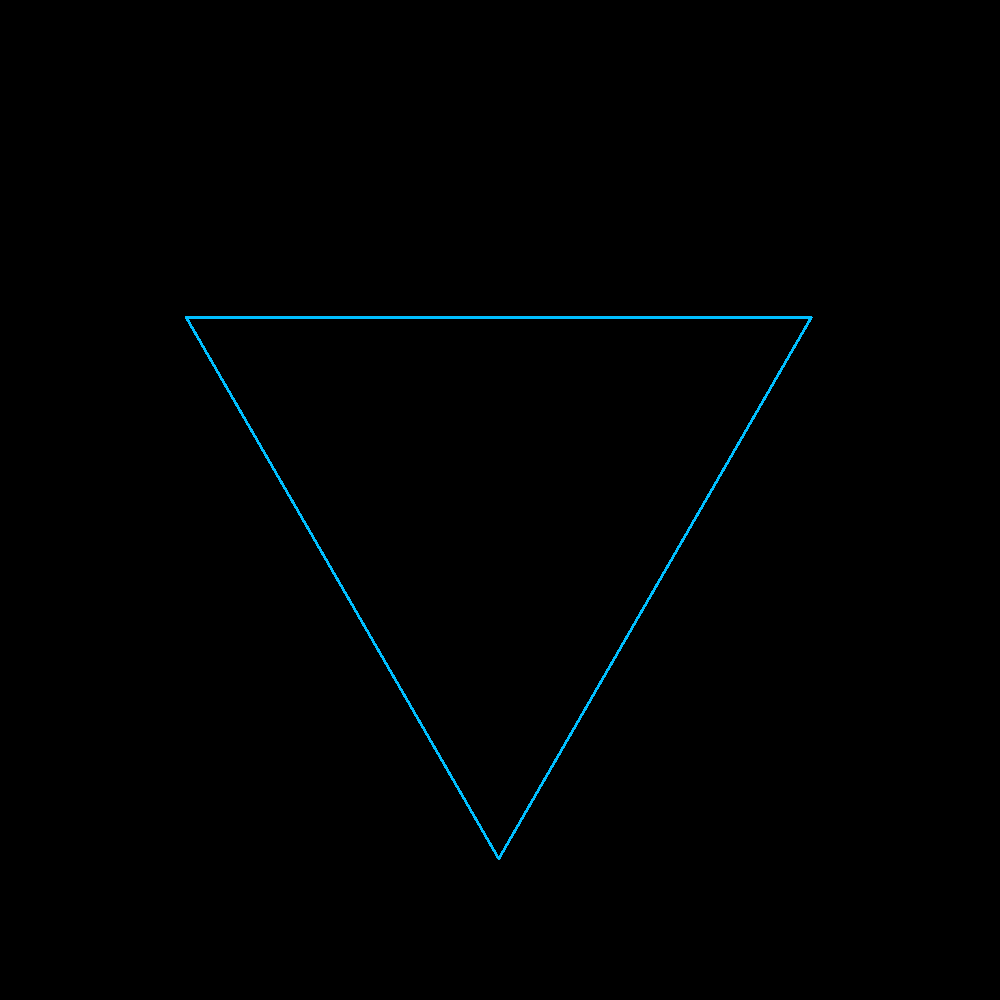

# ❄️ Koch Fractal ❄️

This repository provides Python scripts to visualize Koch fractals, including the Koch curve, Koch snowflake and a randomized variation of the Koch snowflake.



- **Koch Curve**: Draw a single Koch curve up to a specified recursion depth.
- **Koch Snowflake**: Visualize the famous snowflake pattern built using Koch principles.
- **Randomized Koch Snowflake**: Generate a Koch snowflake with random variations in the fractal structure for unique patterns.

## Installation

1. Clone the repository:
```bash
git clone https://github.com/alexanderk001/koch-fractal.git
```
    
2. Navigate into the folder:
```bash
cd koch-fractal
```

3. Make sure you have Python 3.7 or later installed, which includes the `turtle` module.

## Usage

1. Navigate to the `src` folder.

2. Run the script for the desired fractal:
```bash
python koch_curve.py
```

## Repository Structure

- **`src/`**: Contains Python scripts for generating the fractals.
- **`images/`**: Example outputs from the scripts.

## Contributions

Feel free to contribute by adding enhancements, fixing issues, or creating new variations of Koch fractals. Open a pull request, and we'll review it as soon as possible!

## License

This project is licensed under the MIT License.
